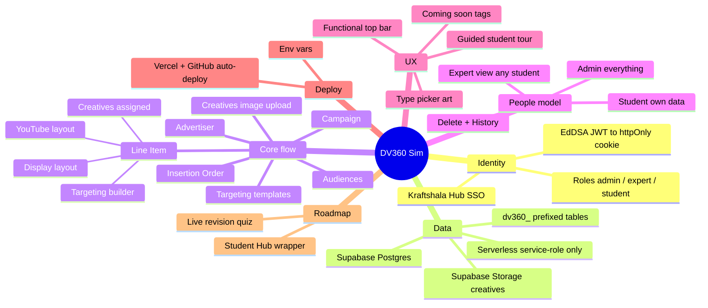
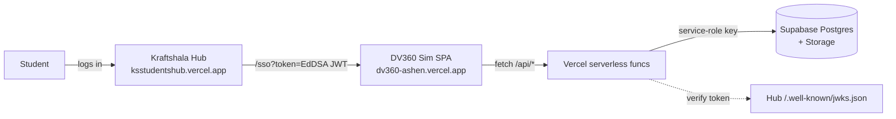

# DV360 Simulation — Full Project Context & Handoff

> A single, portable, top-to-bottom record of this project: what it is, how it's built,
> every major decision and why, the data model, APIs, deployment, gotchas, and roadmap.
> Written so you can move the project to any IDE / AI coding tool and keep full context.

_Last updated: 2026-07. Live at **https://dv360-ashen.vercel.app** · Repo **github.com/cyrustaneja/dv360**_

---

## 1. What this is (one paragraph)

A **training simulation of Google Display & Video 360 (DV360)** for Kraftshala students.
It looks and behaves like the real DV360 ad platform, but everything is a safe sandbox — students
build advertisers, campaigns, insertion orders, line items, creatives, audiences and targeting
templates to practice, with nothing spending real money. It is **one simulation inside the
Kraftshala Simulation Hub**: students log in on the Hub and are handed off here via SSO.

---

## 2. Mind map



If your viewer doesn't render Mermaid mindmaps, the same tree in plain text:

```
DV360 Simulation
├─ Identity: Kraftshala Hub SSO (EdDSA JWT → httpOnly session cookie); roles admin/expert/student
├─ Data: Supabase Postgres, accessed ONLY via serverless /api using the service-role key; tables prefixed dv360_; images in Supabase Storage
├─ Core flow: Advertiser → Campaign → Insertion Order → Line Item → Creatives; plus Audiences + Targeting templates
├─ People model: student=own data, expert=view/edit any student, admin=everything; delete + change history
├─ UX: guided student tour, functional top-bar, "Coming soon"/"Upcoming" tags on unbuilt parts, DV360-exact type picker
├─ Deploy: Vercel + GitHub auto-deploy; env-driven config
└─ Roadmap: wrap as "Kraftshala Student Hub" + live Kahoot-style revision quiz
```

---

## 3. Architecture



- **Frontend:** React 18 + Vite SPA, HashRouter, TailwindCSS. Client never talks to Supabase directly.
- **Backend:** Vercel serverless functions in `/api` (Node). They hold the **service-role key** and do all DB reads/writes, scoped in code by the logged-in user's id.
- **DB:** Supabase Postgres (shared with the Hub — project `rzmazsztojfnclvskbob`). Row-Level Security is defence-in-depth only; access control is enforced in the serverless layer.
- **Auth:** No login in this app. The Hub signs the user in and forwards them via SSO.

---

## 4. Tech stack & key versions

| Layer | Choice | Notes |
|---|---|---|
| UI | React 18 + Vite + TypeScript + Tailwind | HashRouter (no server routing needed) |
| Auth | `jose` (JWT verify) | EdDSA + RS256 accepted |
| DB client (server) | `@supabase/supabase-js` **pinned to 2.45.4** | newer versions crash on Node < 22 without native WebSocket |
| DB migrations | `pg` + `scripts/migrate.mjs` | run DDL directly via pooler connection |
| Hosting | Vercel (frontend + `/api` serverless) | auto-deploys on push to `main` |
| Storage | Supabase Storage bucket `dv360-creatives` (public) | real creative images |

---

## 5. Auth & SSO (how login works)

1. Hub links students to `https://dv360-ashen.vercel.app/sso?token=<JWT>` (routed to `api/sso.ts` via `vercel.json` rewrite).
2. `api/_lib/session.ts` → `verifyHubToken()` validates the JWT against the Hub's JWKS
   (`${HUB_URL}/.well-known/jwks.json`), requiring **issuer = HUB_URL**, **audience = "dv360"**,
   **alg ∈ {EdDSA, RS256}**. (The Hub signs with **EdDSA / Ed25519**, kid `hub-key-2026-ed`.)
3. On success we mint our **own** HS256 session JWT (signed with `SESSION_SECRET`), store it in an
   **httpOnly cookie** (`dv360_session`, 24h), and redirect into the SPA. We never persist the raw Hub token.
4. `GET /api/me` returns the identity from that cookie. No valid session → the app shows a
   "Please launch from the Kraftshala Hub" page (never a login form).

**Token claims used:** `sub` (= the user id, the key for all their data), `email`, `name`,
`role` (admin | expert | student), `batch`, `course`.

**Local dev backdoor:** `api/dev-token.ts` mints a session WITHOUT the Hub — enabled only when the
request host is `localhost` (or `DEV_LOGIN_SECRET` is set). The launch page shows one-click
**Student / Expert / Admin** buttons + a custom-email form. **Disabled in production.**

---

## 6. Roles & access model (important)

- **Student** — sees/edits only their **own** advertisers & everything inside them (keyed by `claims.sub`).
- **Expert** — staff; sees **all** advertisers; Home has a **"View student work"** search to scope to
  one student; can **edit and delete** any student's work.
- **Admin** — everything an expert can, plus (conceptually) full control.

Access is enforced in `api/entities.ts` / `api/advertisers.ts` via `canAccessAdvertiser()` and
`isStaff()`. `api/students.ts` (staff-only) powers the expert student search.

---

## 7. Data model (Supabase, all `dv360_` prefixed)

Every row is keyed by `user_id` → `public.profiles(id)` (= `claims.sub`). `profiles`, `is_admin()`
belong to the **Hub** (we don't own them). Columns are mostly `text` (sim data, not typed money).

- **dv360_advertisers** (id, user_id, name, batch, created_at) — top-level workspace.
- **dv360_campaigns** (…, advertiser_id, name, status, goal, kpi_goal, budget, planned_spend, start_date, end_date, **settings jsonb**, updated_at).
- **dv360_insertion_orders** (…, advertiser_id, campaign_id, name, io_type, status, budget, pacing, freq_cap, kpi_type, kpi_value, dates, **settings jsonb**, updated_at).
- **dv360_line_items** (…, advertiser_id, io_id, name, li_type, status, budget_type, budget, pacing, bid_strategy, bid_amount, freq_cap, **targeting jsonb**, **settings jsonb**, updated_at).
- **dv360_creatives** (…, advertiser_id, name, dimensions, creative_type, click_url, accent, **settings jsonb** [holds `image_url`], updated_at).
- **dv360_targeting_templates** (…, advertiser_id, name, li_type, **targeting jsonb**, settings, updated_at).
- **dv360_audiences** (…, advertiser_id, name, audience_type, source, **settings jsonb**, updated_at).
- **dv360_progress** (user_id, status, score, updated_at) — reserved (per-student progress).
- **dv360_events** (id, user_id, event_type, **payload jsonb**, created_at) — the **change/history log**
  (payload has `entity_id`, `entity_type`, `action`, `actor`, `note`).

**Flexible `settings jsonb`** on every entity is the design that lets us add new fields WITHOUT
migrations (e.g., line-item `ad_formats`, `exp_freq`, `view_freq`, `objective`, `creative_ids`,
`flight_start/end`; campaign `freq_mode`; creative `image_url`).

**Storage:** bucket `dv360-creatives` (public) holds uploaded creative images; URL saved in
`creatives.settings.image_url`.

---

## 8. Serverless API (`/api/*`)

- `sso.ts` — verify Hub token → set session cookie → redirect. (`/sso` rewrites here.)
- `me.ts` — current identity from cookie, else 401.
- `logout.ts` — clear cookie.
- `dev-token.ts` — LOCAL-ONLY test login (find/create a real auth user + profile).
- `advertisers.ts` — GET (own; staff all; `?user_id=` filter; includes owner email/name), POST create, DELETE (owner/staff, cascades).
- `entities.ts` — the workhorse. GET returns `{campaigns, ios, lineItems, creatives, templates, audiences}` for an advertiser. POST create / PATCH update / DELETE — for types `campaign | io | line_item | creative | targeting_template | audience`. Logs every create/update/delete to `dv360_events`.
- `students.ts` — staff-only list of student profiles (for expert search).
- `upload.ts` — auth'd image upload (base64 → Supabase Storage → public URL).
- `history.ts` — change log for one entity (reads `dv360_events` by `entity_id`).
- `_lib/session.ts` — shared: `verifyHubToken`, `createSession`, `readSession`, cookie helpers, `admin()` (service-role client), `requireSession`, `isStaff`. **Note:** files here use explicit `.js` import extensions (see gotchas).

---

## 9. Frontend structure

- `src/App.tsx` — HashRouter routes. Guards in `src/auth/guards.tsx` (`RequireAuth`, `RequireStaff`).
- `src/auth/` — `AuthContext` (reads `/api/me`), `LaunchFromHub` (+ local dev-login buttons).
- `src/store.tsx` — the data layer: loads advertisers + entities via `/api`, keeps `state` (mapped for UI) and `state.raw.*` (full rows for edit prefill), plus students/expert-view, and all add/update/delete methods.
- `src/lib/api.ts` — thin fetch client for `/api`.
- `src/screens/` — `Home` (advertiser picker + expert student search + guided tour), `advertiser/*` (Campaigns, CampaignDetail, InsertionOrderDetail, **LineItemDetail** [inline editor], Creatives, Audiences, TargetingTemplates, + Placeholders), `wizards/*` (New… creators).
- `src/components/`:
  - **TargetingBuilder.tsx** — DV360-style targeting (Inventory source rows + pencil→PickerModal + "Add targeting"), **shared** by line items & templates. Takes `audienceOptions` (student's own audiences).
  - **TypePicker.tsx** — the 6-card line-item/template type selector with exact DV360 SVG illustrations; `isYouTubeType()` decides the line-item layout.
  - **GuidedTour.tsx** — student onboarding coach panel (auto-advances as they build); re-triggerable via `startTour()` event.
  - **EntityHistory.tsx** — renders `/api/history` for a detail screen's History tab.
  - `layout/AppHeader.tsx` — functional top bar (search/notifications/apps/help/switch/tour) + user menu. `layout/Sidebar.tsx` + `layout/nav.ts` — nav with "Upcoming" tags.

**Line item is adaptive by type:** `isYouTubeType()` (Video, YouTube & partners video) →
YouTube layout (media type, objective, ad format, exposure+view frequency, Ad groups). Others →
Display layout (inventory source + creatives). Editing is **inline** on the detail page with a
sticky **Save / Reset / note** bar. Creation is just the type picker → creates a draft → editor.

---

## 10. Key decisions & rationale (the "why")

1. **Portable single-file build (early Phase 1):** IIFE classic script moved to end of `<body>` so the
   `.html` opens on double-click (`file://`); Chrome blocks ES-module scripts on `file://`. (`build:single`.)
2. **Hub SSO model (Phase 2 pivot):** removed all self-login; identity comes from the Hub. This app is
   one sim inside the Hub. Chosen over building our own auth.
3. **All DB access via serverless with service-role key** (browser never holds keys). RLS is
   defence-in-depth; real enforcement is in `/api` code. Simpler + safer for a shared DB.
4. **`.js` import extensions in `/api`:** Vercel's ESM runtime requires explicit extensions
   (`./_lib/session.js`) or functions 500 with `ERR_MODULE_NOT_FOUND`. Vite dev resolves `.js`→`.ts` fine.
5. **`@supabase/supabase-js` pinned to 2.45.4:** newer versions crash on Vercel's Node without native WebSocket.
6. **Per-student data scoping by `claims.sub`;** staff see all. Matches "students practice independently."
7. **Flexible `settings jsonb` per table:** add fields without migrations. Big win for iteration speed.
8. **Accept EdDSA (not just RS256) in SSO:** the Hub signs with Ed25519. (Cost us a "launch from Hub" bug once.)
9. **Adaptive line-item layout + inline editing** to match real DV360 exactly (from screen recordings).
10. **Honesty for demos:** anything not truly working is tagged **"Coming soon"/"Upcoming"** (Audio/CTV/Demand
    Gen line-item types; Inventory/Reports/Experiments/Resources/Advertiser settings/History nav; Conversions/
    Product feed/Related videos/Ad groups on line items; video/HTML5 creatives). Fake metric cards & delivery
    columns were removed. Nothing fake is shown to a founder.
11. **Real creative images** via Supabase Storage (a creative without a real image "doesn't make sense").
12. **Guided student tour** so students learn DV360 and build one full campaign, then explore.

---

## 11. Deployment & config

- **GitHub:** `github.com/cyrustaneja/dv360`. Pushing to `main` **auto-deploys** to Vercel.
- **Vercel project `dv360`** → live at `dv360-ashen.vercel.app`. `vercel.json` has the `/sso`→`/api/sso`
  rewrite + SPA fallback.
- **Environment variables (Vercel, server unless noted):**
  | Name | Purpose |
  |---|---|
  | `HUB_URL` | Hub base URL — token issuer + JWKS host. **Currently must be `https://ksstudentshub.vercel.app`** |
  | `VITE_HUB_URL` | same, baked into frontend (the "Go to Hub" link) — needs a redeploy to change |
  | `SESSION_SECRET` | signs our session cookie (any long random string) |
  | `SUPABASE_URL` | `https://rzmazsztojfnclvskbob.supabase.co` |
  | `SUPABASE_SERVICE_ROLE_KEY` | server-only DB key |
  | **do NOT set** `DEV_LOGIN_SECRET` in prod | leaving it out keeps the local backdoor off |
- **DB migrations:** `node scripts/migrate.mjs "<SQL>"` (uses PG **pooler** creds in `.env.local`:
  `PGHOST=aws-1-ap-south-1.pooler.supabase.com`, `PGUSER=postgres.rzmazsztojfnclvskbob`). The direct
  `db.<ref>.supabase.co` host is IPv6-only and unreachable from most machines — always use the pooler.
- **Supabase project:** `rzmazsztojfnclvskbob`. Storage bucket `dv360-creatives` (public).

**⚠️ HUB URL CHANGE (open action):** Hub moved from `simulationmixer-dv360-more.vercel.app` →
`https://ksstudentshub.vercel.app`. Update `HUB_URL` **and** `VITE_HUB_URL` in Vercel and redeploy,
or live SSO shows the "launch from Hub" page. Local `.env.local` is already updated.

---

## 12. Local development

```bash
cd dv360-simulation
npm install
npm run dev            # http://localhost:5173
```
- `dev-api-plugin.ts` serves `/api/*` inside Vite (reads `.env.local`), so the full stack runs locally.
- On the launch screen use the **Student / Expert / Admin** dev-login buttons (localhost only), or the
  custom-email box to test data isolation between students.
- `.env.local` (git-ignored) holds all secrets incl. the PG pooler creds. `.env.example` documents them.

---

## 13. Gotchas / non-obvious things

- **Always use the PG pooler host** for migrations (direct host is IPv6-only).
- **`/api` relative imports need `.js` extensions** (Vercel ESM). Don't remove them.
- **Don't bump `@supabase/supabase-js`** past 2.45.4 without testing on Vercel.
- **`VITE_HUB_URL` is build-time** — changing it needs a redeploy, not just an env edit.
- SSO tokens are **short-lived (~2 min)** — always test with a fresh Hub launch.
- The app uses **HashRouter**, so deep links look like `/#/advertiser/...`.
- After reload, the advertiser guard can bounce to Home until advertisers load (async) — click into an
  advertiser rather than deep-linking cold.

---

## 14. Secrets & security

- The browser never holds Supabase keys — all through `/api`.
- **Rotate now (pasted in chat during development):** the **service-role key** and the **DB password**
  (`Kraftshala@1234`). Supabase → Settings → API (regenerate service key) + Database (reset password),
  then update Vercel env + local `.env.local`.
- `DEV_LOGIN_SECRET` must never be set in production.

---

## 15. Status snapshot (what's built vs pending)

**Working (create + view + edit + delete, all saved):** Advertisers, Campaigns, Insertion Orders,
Line Items (YouTube + Display, inline editor, targeting builder, creatives linked), Creatives
(real image upload), Audiences, Targeting Templates. Expert student-access + search. Change history.
Student guided tour. Functional top bar. DV360-exact type picker.

**Marked "Coming soon"/"Upcoming" (intentionally not built):** Audio/Connected TV/Demand Gen line-item
types; Inventory, Reports, Experiments, Resources, Advertiser settings, History nav sections;
Conversions/Product feed/Related videos/Ad groups on line items; video & HTML5 creatives; live delivery
metrics/reporting.

**Open actions:** (1) update Hub URL in Vercel (§11); (2) rotate secrets (§14).

---

## 16. Roadmap — "Kraftshala Student Hub" + Live Revision Quiz (not yet built)

Reframe the app as a **Student Hub** landing that lists activities (DV360 sim = one) and add a
**Kahoot-style live revision quiz** for after each class session:

- **Admin** uploads a quiz (title + questions: text, 4 options, correct one, per-question timer). Store
  in `quiz_quizzes(id, title, created_by, questions jsonb, created_at)`.
- **Expert** launches a live session for their batch (join code, host controls: start / next / reveal /
  end, live leaderboard). `quiz_sessions(id, quiz_id, host_id, code, status, current_index,
  question_started_at, batch)`.
- **Students** play live, one timed question at a time; **fullscreen + leave-detection** (log tab/fullscreen
  exits — true OS lock isn't possible in a browser). `quiz_participants(id, session_id, user_id, name,
  score)`, `quiz_answers(id, session_id, participant_id, question_index, choice, is_correct, ms, awarded)`.
- **Analytics** dashboards: per-quiz / per-student scores, per-question accuracy (weak topics), day/week/
  month trends, filter by batch.
- **Approach:** new `/api/quiz*` serverless endpoints (service-role, session-gated); **live sync via
  polling** (~1s) — no websockets for the MVP; reuse existing session/claims/isStaff.
- **Build isolated** (branch or folder copy), **don't push until approved**. Acceptance: admin uploads →
  expert launches → 2 students join on separate logins → timed question → scores recorded → leaderboard →
  analytics shows per-question accuracy + a trend; fullscreen + leave-detection logs exits.

---

## 17. Key file map

```
api/
  sso.ts me.ts logout.ts dev-token.ts
  advertisers.ts entities.ts students.ts upload.ts history.ts
  _lib/session.ts
scripts/migrate.mjs
src/
  App.tsx main.tsx store.tsx
  auth/ (AuthContext, LaunchFromHub, guards)
  lib/api.ts
  components/ (TargetingBuilder, TypePicker, GuidedTour, EntityHistory, layout/*)
  screens/ (Home, advertiser/*, wizards/*, Placeholders)
supabase/dv360_schema.sql        # base tables (later ones added via scripts/migrate.mjs)
vercel.json  vite.config.ts  dev-api-plugin.ts  .env.example  DEPLOY.md
```
